# Mybatis

环境：

* JDK1.8以上
* Mysql 5.7以上
* maven 3.6.1
* IDEA

回顾：

* JDBC
* Mysql
* Java基础
* Maven
* Junit

SSM框架：基于配置文件的，最好的方式：官方文档

Mybatis官网文档：[点击](http://mybatis.org/spring/zh/index.html)或[点击](http://www.mybatis.cn/)

# 一、简介

### 1.1、什么是Mybatis


* MyBatis一款持久层框架
* 支持定制SQL、存储过程以及高级映射
* MyBatis几乎避免了所有JDBC代码和手动设置参数以及获取结果集
* MyBatis可以使用简单的XML或注解来配置和映射原生类型、接口和Java的POJO（Plain Old Java Object，普通老式Java对象）为数据库中的记录
* MyBatis本是apache的开源项目iBatis，2010年这个项目由apache software foundation迁移到了google code，并改名为MyBatis
* 2013年11月迁移到Github


如何获得MyBatis？

* maven仓库

```xml
<!-- https://mvnrepository.com/artifact/org.mybatis/mybatis -->
<dependency>
    <groupId>org.mybatis</groupId>
    <artifactId>mybatis</artifactId>
    <version>3.4.6</version>
</dependency>
```

* Github：https://github.com/mybatis/mybatis-3/releases
* 中文文档：https://mybatis.org/mybatis-3/zh/index.html


### 1.2、持久层

数据持久化

* 持久化就是将程序的数据在持久状态和瞬时状态转化的过程
* 内存：**断电即失**
* 数据库(jdbc)，io文件持久化
* 生活中：冷藏、罐头

**为什么要持久化？**

* 有一些东西，不能遗失
* 内存贵


### 1.3、持久层

Dao层，Service层，Controller层

* 完成持久化工作的代码块
* 层界限十分明显


### 1.4、为什么需要MyBatis？

* 帮助程序员将数据存入到数据库中
* 简洁、方便
* 传统的JDBC代码太复杂了，简化、框架、自动化
* 使用MyBatis更容易上手
* **技术没有高低之分**
* 优点：
  - 简单易学
  - 灵活
  - sql与代码分离，提高了代码的可维护性
  - 提供映射标签，支持对象与数据库的orm字段关系映射
  - 提供对象关系映射标签，支持对象关系组建维护
  - 提供xml标签，支持编写动态sql


**最重要的是：使用的人多**

# 二、第一个MyBatis程序

思路：搭建环境-->导入MyBatis-->编写代码-->测试

### 2.1、搭建环境

搭建数据库

```mysql
CREATE DATABASE mybatis;

USE mybatis;

CREATE TABLE user(
	id INT PRIMARY KEY,
	name VARCHAR(30) DEFAULT NULL,
	pwd VARCHAR(30) DEFAULT NULL
)ENGINE=INNODB DEFAULT CHARSET=utf8;

INSERT INTO user(id,name,pwd) VALUES(1,'guigui','0621'),
(2,'zhangsan','1234'),
(3,'lisi','5678')
```

新建项目

1. 新建一个普通的maven项目

2. 删除src目录（用作为父工程）

3. 导入maven依赖

   ```xml
   <!--导入依赖-->
       <dependencies>
           <!--mysql驱动-->
           <!-- https://mvnrepository.com/artifact/mysql/mysql-connector-java -->
           <dependency>
               <groupId>mysql</groupId>
               <artifactId>mysql-connector-java</artifactId>
               <version>8.0.16</version>
           </dependency>
           <!--mybatis-->
           <!-- https://mvnrepository.com/artifact/org.mybatis/mybatis -->
           <dependency>
               <groupId>org.mybatis</groupId>
               <artifactId>mybatis</artifactId>
               <version>3.5.3</version>
           </dependency>
           <!--junit-->
           <!-- https://mvnrepository.com/artifact/junit/junit -->
           <dependency>
               <groupId>junit</groupId>
               <artifactId>junit</artifactId>
               <version>4.12</version>
               <scope>test</scope>
           </dependency>
       </dependencies>
   ```

### 2.2、创建一个模块

* 编写mybatis的核心配置文件

  ```xml
  <?xml version="1.0" encoding="UTF-8" ?>
  <!DOCTYPE configuration
          PUBLIC "-//mybatis.org//DTD Config 3.0//EN"
          "http://mybatis.org/dtd/mybatis-3-config.dtd">
  <!--configuration核心配置文件-->
  <configuration>
  <!--    environments：环境复数（可以有多套，通过default属性指定）-->
      <environments default="development">
          <environment id="development">
  <!--            transactionManager：事务管理：JDBC的-->
              <transactionManager type="JDBC"/>
              <dataSource type="POOLED">
                  <property name="driver" value="com.mysql.cj.jdbc.Driver"/>
                  <property name="url" value="jdbc:mysql://localhost:3306/mybatis?useSSL=true&amp;useUnicode=true&amp;characterEncoding=UTF-8&amp;serverTimezone=UTC"/>
                  <property name="username" value="root"/>
                  <property name="password" value="ghost"/>
              </dataSource>
          </environment>
      </environments>
  </configuration>
  ```

* 编写mybatis工具类

  ```java
  //sqlSessionFactory --> sqlSession
  public class MybatisUtils {
      private static SqlSessionFactory sqlSessionFactory;
      static {
          try {
              //使用Mybatis第一步：获取sqlSessionFactory对象
              String resource = "mybatis-config.xml";
              InputStream inputStream = Resources.getResourceAsStream(resource);
              sqlSessionFactory = new SqlSessionFactoryBuilder().build(inputStream);
          } catch (IOException e) {
              e.printStackTrace();
          }
      }
      //既然有了 SqlSessionFactory，顾名思义，我们可以从中获得 SqlSession 的实例
      //SqlSession 提供了在数据库执行 SQL 命令所需的所有方法
      public static SqlSession getSqlSession(){
          return sqlSessionFactory.openSession();
      }
  }
  ```

### 2.3、编写代码

* 实体类

  ```java
  package com.guighost.pojo;
  
  /**
   * @ClassName User
   * @Description TODO
   * @Author GuiGhost
   * @Date 2021/01/23 16:07
   * @Version 1.0
   **/
  public class User {
      private int id;
      private String name;
      private String pwd;
  
      public User() {
      }
  
      public User(int id, String name, String pwd) {
          this.id = id;
          this.name = name;
          this.pwd = pwd;
      }
  
      public int getId() {
          return id;
      }
  
      public void setId(int id) {
          this.id = id;
      }
  
      public String getName() {
          return name;
      }
  
      public void setName(String name) {
          this.name = name;
      }
  
      public String getPwd() {
          return pwd;
      }
  
      public void setPwd(String pwd) {
          this.pwd = pwd;
      }
  
      @Override
      public String toString() {
          return "User{" +
                  "id=" + id +
                  ", name='" + name + '\'' +
                  ", pwd='" + pwd + '\'' +
                  '}';
      }
  }
  ```

* Dao接口

  ```java
  package com.guighost.dao;
  
  import com.guighost.pojo.User;
  
  import java.util.List;
  
  /**
   * @InterfaceName UserDao
   * @Description TODO
   * @Author GuiGhost
   * @Date 2021/01/23 16:10
   * @Version 1.0
   **/
  public interface UserDao {
      List<User> getUserList();
  }
  
  ```

* 接口实现类(由原来的实现类UserDaoImpl变成了UserMapper.xml)

  ```xml
  <?xml version="1.0" encoding="UTF-8" ?>
  <!DOCTYPE mapper
          PUBLIC "-//mybatis.org//DTD Mapper 3.0//EN"
          "http://mybatis.org/dtd/mybatis-3-mapper.dtd">
  <!--namespace=绑定一个对应的Dao/Mapper接口-->
  <mapper namespace="com.guighost.dao.UserDao">
      <!--select查询语句-->
      <select id="getUserList" resultType="com.guighost.pojo.User">
          select * from mybatis.user
      </select>
  </mapper>
  ```

### 2.4、测试

注意点：

org.apache.ibatis.binding.BindingException: Type interface com.guighost.dao.UserDao is not known to the MapperRegistry.

**MapperRegistry是什么？**

> 核心配置文件中注册mappers

```xml
<!--    每一个Mapper.xml文件都需要在Mybatis核心配置文件中注册-->
    <mappers>
        <mapper resource="com/guighost/dao/UserMapper.xml"/>
    </mappers>
```

* Junit测试

  ```java
  @Test
      public void test(){
          //第一步获得SqlSession对象
          SqlSession sqlSession = MybatisUtils.getSqlSession();
  
          //方式一：getMapper
          UserDao userDao = sqlSession.getMapper(UserDao.class);
          List<User> userList = userDao.getUserList();
  
          for (User user : userList) {
             System.out.println(user);
          }
  
          //关闭SqlSession
          sqlSession.close();
      }
  ```

可能遇到的问题：

1. 配置文件没有注册

2. 绑定接口错误

3. 方法名不对

4. 返回类型不对

5. Maven导出资源问题

6. mybatis-config.xml中写中文注释报错问题

   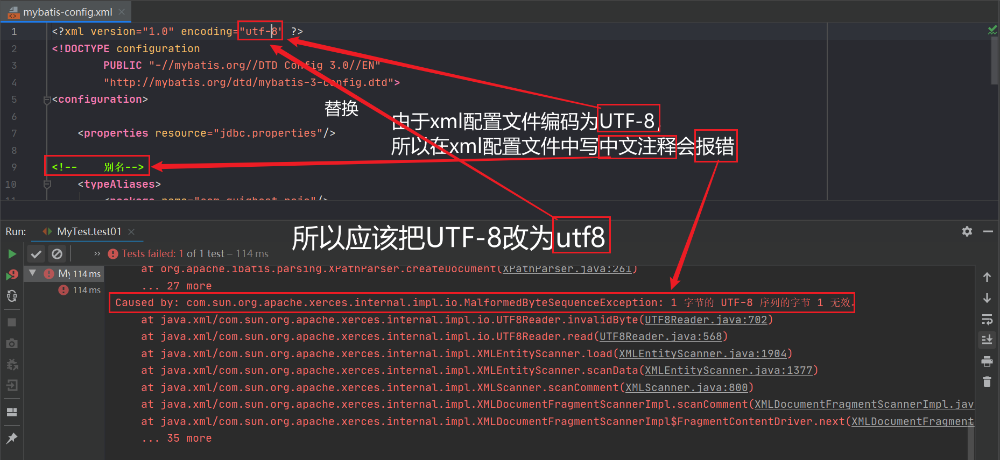

   解决：

   ```xml
   <?xml version="1.0" encoding="utf8" ?>
   ```

   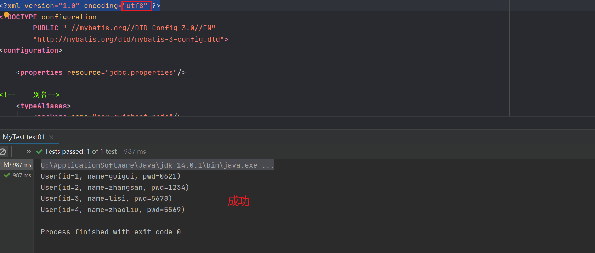

# 三、CRUD

### 1、namespace

namespace中的包名应与Dao/Mapper接口的包名一致！

### 2、Select

选择，查询语句：

* id：对应的是namespace中的方法名
* resultType：sql语句执行的返回值！
* parameterType：参数类型!


1. 编写接口

   ```java
   //查询所有用户
   List<User> getUserList();
   //根据id查询用户
   User getUserById(int id);
   //添加一个用户
   boolean addUser(User user);
   //修改用户
   boolean updateUser(User user);
   //删除用户
   boolean deleteUser(int id);
   ```

2. 编写对应的mapper中的sql语句

   ```xml
   <!--namespace=绑定一个对应的Dao/Mapper接口-->
   <mapper namespace="com.guighost.dao.UserMapper">
   <!--    select查询语句-->
       <select id="getUserList" resultType="com.guighost.pojo.User">
           select * from mybatis.user
       </select>
       
       <select id="getUserById" parameterType="int" resultType="com.guighost.pojo.User">
           select * from mybatis.user where id = #{id}
       </select>
   
   <!--    对象中的属性，可以直接取出来，通过#{属性名}-->
       <insert id="addUser" parameterType="com.guighost.pojo.User">
           insert into mybatis.user(id, name, pwd) values (#{id},#{name},#{pwd})
       </insert>
   
       <update id="updateUser" parameterType="com.guighost.pojo.User">
           update mybatis.user set name = #{name},pwd = #{pwd} where id = #{id}
       </update>
   
       <delete id="deleteUser" parameterType="int">
           delete from mybatis.user where id = #{id}
       </delete>
   </mapper>
   ```

3. 测试

   ```java
   package com.guighost.dao;
   
   import com.guighost.pojo.User;
   import com.guighost.utils.MybatisUtils;
   import org.apache.ibatis.session.SqlSession;
   import org.junit.Test;
   
   import java.util.List;
   
   /**
    * @ClassName UserDaoTest
    * @Description TODO
    * @Author GuiGhost
    * @Date 2021/01/26 13:51
    * @Version 1.0
    **/
   public class UserDaoTest {
       @Test
       public void test(){
           //第一步获得SqlSession对象
           SqlSession sqlSession = null;
   
           try{
               sqlSession = MybatisUtils.getSqlSession();
               //方式一：getMapper
               UserMapper userMapper = sqlSession.getMapper(UserMapper.class);
               List<User> userList = userMapper.getUserList();
   
               //方式二：
   //        List<User> userList = sqlSession.selectList("com.guighost.dao.UserDao.getUserList");
   
               for (User user : userList) {
                   System.out.println(user);
               }
           }catch (Exception e){
               e.printStackTrace();
           }finally {
               //关闭SqlSession
               sqlSession.close();
           }
       }
   
       @Test
       public void getUserById(){
           SqlSession sqlSession = MybatisUtils.getSqlSession();
           UserMapper mapper = sqlSession.getMapper(UserMapper.class);
           User userById = mapper.getUserById(1);
           System.out.println(userById);
   
           sqlSession.close();
       }
   
   
       //增删改需要提交事务
       @Test
       public void addUser(){
           SqlSession sqlSession = MybatisUtils.getSqlSession();
           UserMapper mapper = sqlSession.getMapper(UserMapper.class);
           boolean b = mapper.addUser(new User(4, "wangwu", "889"));
           if (b){
               System.out.println("success");
           }
           //提交事务
           sqlSession.commit();
           sqlSession.close();
       }
   
       @Test
       public void updateUser(){
           SqlSession sqlSession = MybatisUtils.getSqlSession();
           UserMapper mapper = sqlSession.getMapper(UserMapper.class);
           boolean b = mapper.updateUser(new User(4, "zhaoliu", "11235"));
           if (b){
               System.out.println("success");
           }
           //提交事务
           sqlSession.commit();
           sqlSession.close();
       }
   
       @Test
       public void deleteUser(){
           SqlSession sqlSession = MybatisUtils.getSqlSession();
           UserMapper mapper = sqlSession.getMapper(UserMapper.class);
           boolean b = mapper.deleteUser(4);
           if (b){
               System.out.println("success");
           }
           //提交事务
           sqlSession.commit();
           sqlSession.close();
       }
   }
   ```

### 3、Insert

```xml
<!--    对象中的属性，可以直接取出来，通过#{属性名}-->
    <insert id="addUser" parameterType="com.guighost.pojo.User">
        insert into mybatis.user(id, name, pwd) values (#{id},#{name},#{pwd})
    </insert>
```

### 4、Update

```xml
<update id="updateUser" parameterType="com.guighost.pojo.User">
        update mybatis.user set name = #{name},pwd = #{pwd} where id = #{id}
</update>
```

### 5、Delete

```xml
<delete id="deleteUser" parameterType="int">
        delete from mybatis.user where id = #{id}
</delete>
```


**注意点：**

* 增删改需要提交事务！

### 6、分析错误

* 标签不能匹配错误
* resource绑定mapper，需要使用路径！
* 程序配置文件必须符合规范！
* NullPointerException，没有注册到资源！
* 输出的xml文件中存在中文乱码问题！
* maven资源没有导出问题！

### 7、万能的Map

假设，我们的实体类，或者数据库中的表，字段或者参数过多，我们应当考虑使用Map!

```java
//万能的Map
    boolean addUserForMap(Map<String,Object> map);
```

```xml
<!--    万能的Map：
           传递的是Map的key，用key来获取对应的值
-->
<insert id="addUserForMap" parameterType="map">
     insert into mybatis.user(id, name, pwd) values (#{userId},#{userName},#{userPassword})
</insert>
```

```java
//    万能的Map
@Test
public void testMap(){
     SqlSession sqlSession = MybatisUtils.getSqlSession();
     UserMapper mapper = sqlSession.getMapper(UserMapper.class);
     Map<String,Object> map = new HashMap<String, Object>();
     map.put("userId",4);
     map.put("userName","zhaoliu");
     map.put("userPassword","5569");
     boolean b = mapper.addUserForMap(map);
     if (b){
          System.out.println("success");
     }
     //提交事务
     sqlSession.commit();
     sqlSession.close();
}
```

**小结：**

Map传递参数，直接在sql中取出key即可！

对象传递参数，直接在sql中去对象的属性即可！

只有一个基本类型参数的情况下，可以直接在SQL中取

多个参数用Map，**或者注解！**

### 8、思考

模糊查询怎么写？

1. Java代码执行的时候，传递通配符% %

   ```java
    List<User> userLike = mapper.getUserLike("%zh%");
   ```

2. 在sql拼接中使用通配符！

   ```xml
   <!--    模糊查询-->
       <select id="getUserLike" resultType="com.guighost.pojo.User">
           select * from mybatis.user where name like "%"#{value}"%"
       </select>
   ```


# 四、配置解析

### 1、核心配置文件

* mybatis-config.xml
* MyBatis的配置文件包含了会深深影响MyBatis行为的设置和属性信息
* configuration（配置）          
  - [properties（属性）](https://mybatis.org/mybatis-3/zh/configuration.html#properties)
  - [settings（设置）](https://mybatis.org/mybatis-3/zh/configuration.html#settings)
  - [typeAliases（类型别名）](https://mybatis.org/mybatis-3/zh/configuration.html#typeAliases)
  - [typeHandlers（类型处理器）](https://mybatis.org/mybatis-3/zh/configuration.html#typeHandlers)
  - [objectFactory（对象工厂）](https://mybatis.org/mybatis-3/zh/configuration.html#objectFactory)
  - [plugins（插件）](https://mybatis.org/mybatis-3/zh/configuration.html#plugins)
  - environments（环境配置）
    - environment（环境变量）                  
    - transactionManager（事务管理器）
    - dataSource（数据源）
  - [databaseIdProvider（数据库厂商标识）](https://mybatis.org/mybatis-3/zh/configuration.html#databaseIdProvider)
  - [mappers（映射器）](https://mybatis.org/mybatis-3/zh/configuration.html#mappers)


### 2、环境配置（environments）

MyBatis 可以配置成适应多种环境

**注意：尽管可以配置多个环境，但每个 SqlSessionFactory实例只能选择一种环境**

学会使用配置多套运行环境！

MyBatis默认的事务管理器为JDBC，连接池：POOLED

### 3、属性（properties）

我们可以通过properties属性来实现引用配置文件

这些属性可以在外部进行配置，并可以进行动态替换。你既可以在典型的 Java 属性文件中配置这些属性，也可以在 properties 元素的子元素中设置。【db.properties】

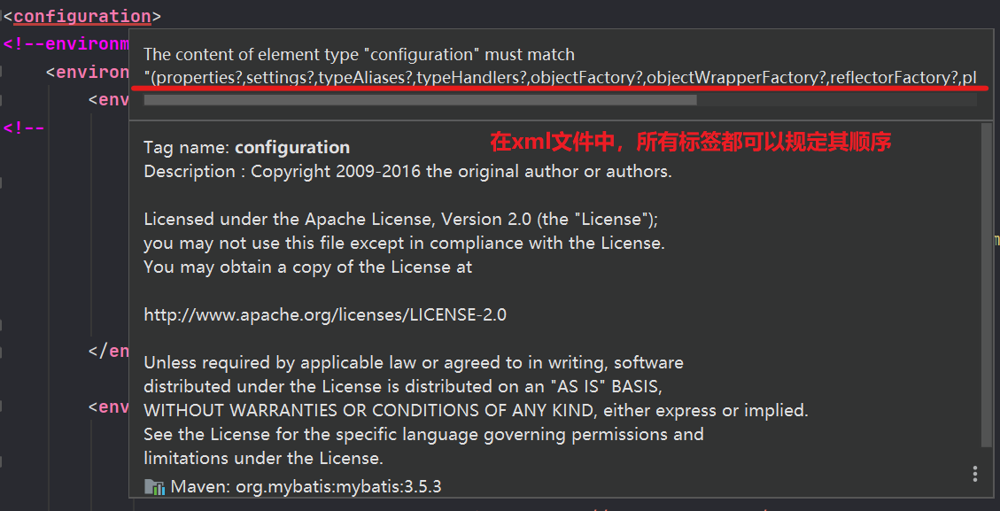

编写一个配置文件

db.properties

```properties
driver=com.mysql.cj.jdbc.Driver
url=jdbc:mysql://localhost:3306/mybatis?useSSL=true&useUnicode=true&characterEncoding=UTF-8&serverTimezone=UTC
username=root
password=ghost
```

在核心配置文件中引入该文件

```xml
<!--引入外部配置文件-->
<properties resource="db.properties">
     <property name="username" value="root"/>
     <property name="password" value="ghost"/>
</properties>
```

* 可以直接引入外部文件
* 可以在其中增加一些属性配置
* 如果两个文件（resource=的文件，在该标签内所定义的字段）有同一个字段，优先使用外部配置文件的字段

### 4、类型别名（typeAliases）

* 类型别名是为Java类型设置一个短的名字
* 存在的意义仅在于用来减少类完全限定名的冗余 

```xml
<!--可以给实体类起别名-->
<typeAliases>
     <typeAlias type="com.guighost.pojo.User" alias="User"/>
</typeAliases>
```

也可以指定一个包名，MyBatis 会在包名下面搜索需要的 Java Bean，比如:

扫描实体类的包，它的默认别名就是这个类的类名首字母小写！

```xml
<typeAliases>
     <package name="com.guighost.pojo"/>
</typeAliases>
```

在实体类较少的时候，建议使用第一种

若实体类较多，建议使用第二种

第一种可以DIY别名

第二种则需要使用@Alias("别名")注解来指定

```java
@Alias("user")
public class User{
     
}
```

### 5、设置

这是 MyBatis 中极为重要的调整设置，它们会改变 MyBatis 的运行时行为

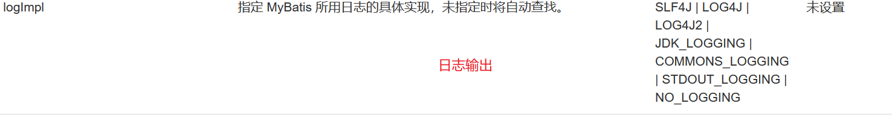

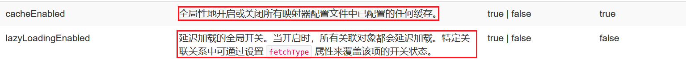


```xml
<settings>
     <setting name="mapUnderscoreToCamelCase" value="true"/><!--开启驼峰命名-->
</settings>
```

### 6、其他配置

* [typeHandlers（类型处理器）](https://mybatis.org/mybatis-3/zh/configuration.html#typeHandlers)
* [objectFactory（对象工厂）](https://mybatis.org/mybatis-3/zh/configuration.html#objectFactory)
* [plugins（插件）](https://mybatis.org/mybatis-3/zh/configuration.html#plugins)
  * mybatis-generator-core
  * mybatis-plus
  * 通用mapper

### 7、映射器（mappers）

MapperRegistry：注册绑定我们的Mapper文件； 

方式一：使用xxxMapper.xml文件【推荐使用】

```xml
<!--每一个Mapper.xml文件都需要在Mybatis核心配置文件中注册-->
<mappers>
     <mapper resource="com/guighost/dao/UserMapper.xml"/>
</mappers>
```

方式二：使用class文件绑定注册

```xml
<!--每一个Mapper.xml文件都需要在Mybatis核心配置文件中注册-->
<mappers>
     <mapper class="com.guighost.dao.UserMapper"/>
</mappers>
```

注意点：

* 接口和它的Mapper配置文件必须同名
* 接口和它的Mapper配置文件必须在同一个包下

方式三：使用扫描包进行注入

```xml
<mappers>
     <package name="com.guighost.dao"/>
</mappers>
```

注意点：

* 接口和它的Mapper配置文件必须同名
* 接口和它的Mapper配置文件必须在同一个包下

### 8、生命周期和作用域

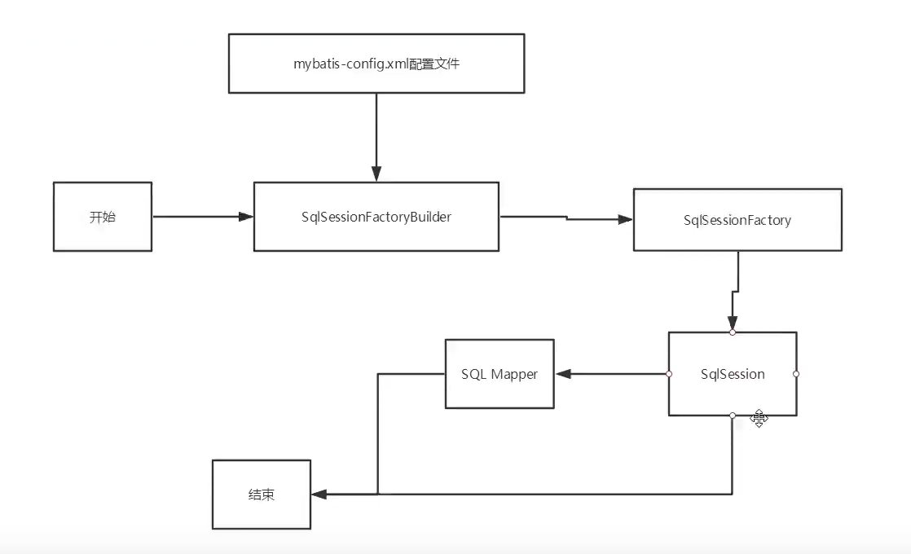

生命周期和作用域是至关重要的，因为错误的使用会导致非常严重的**并发问题**

**SqlSessionFactoryBuilder：**

* 一旦创建了SqlSessionFactory，就不再需要它了
* 局部变量

**SqlSessionFactory：**

* 可以联想为：数据库连接池
* 一旦被创建就应该在应用的运行期间一直存在，**没有任何理由丢弃它或重新创建另一个实例**
* 因此SqlSessionFactory 的最佳作用域是应用作用域
* 最简单的就是使用**单例模式**或者静态单例模式

**SqlSession：**

* 可以联想为连接到连接池的一个请求！
* SqlSession的实例不是线程安全的，因此是不能被共享的，所以它的最佳作用域是请求或方法作用域
* 用完之后需要赶紧关闭，否则资源被占用

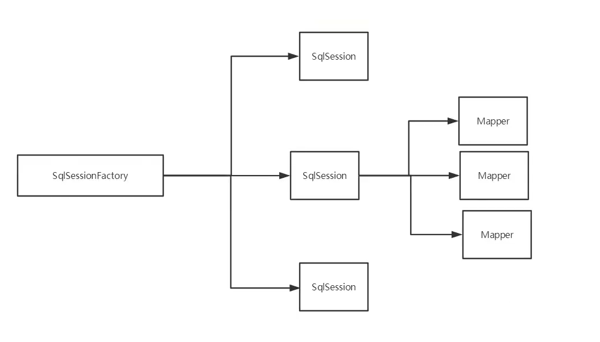

这里的每一个Mapper，就代表一个具体的业务！

# 五、解决属性名和字段名不一致的问题（ResultMap结果集映射）

### 1、问题

数据库中的字段

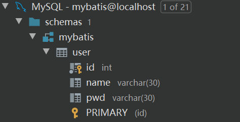

新建一个项目，拷贝之前的，测试实体类字段 

```java
public class User {
    private int id;
    private String username;
    private String password;
}
```

测试出现问题

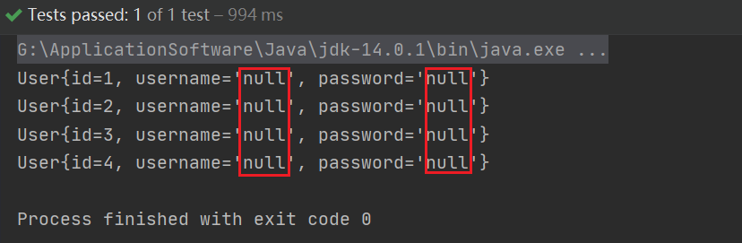

```sql
select * from mybatis.user
//类型处理器
select id,name,pwd from mybatis.user
```

解决方法：

* 起别名

  ```xml
  <select id="getUserList" resultType="user">
       select id,name as username,pwd as password from mybatis.user
  </select>
  ```

### 2、resultMap

结果集映射

```
数据库字段名：  id	name		pwd
实体类名：	id	username	password
```

```xml
<resultMap id="UserMap" type="User">
     <result column="id" property="id"/>
     <result column="name" property="username"/>
     <result column="pwd" property="password"/>
</resultMap>
<!--    select查询语句-->
<select id="getUserList" resultMap="UserMap">
     select * from mybatis.user
</select>
```

* resultType元素是MyBatis中最重要最强大的元素
* ResultMap的设计思想是，对于简单的语句根本不需要配置显式的结果映射，而对于复杂一点的语句只需要描述它们的的关系就行了
* ResultMap最优秀的地方在于，虽然你已经对它相当了解了，但是根本就是不需要显式地用到他们   

# 六、日志

### 1、日志工厂

如果一个数据库操作，出现了异常，我们需要排错。日志就是我们最好的助手

曾经：sout、debug

现在：日志工厂

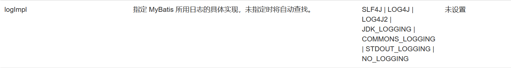

* SLF4J
* LOG4J 【掌握】
* LOG4J2 
* JDK_LOGGING
* COMMONS_LOGGING
* STDOUT_LOGGING【掌握】
* NO_LOGGING              

在MyBatis中具体使用哪个日志实现，在设置中设定

**STDOUT_LOGGING标准日志输出**

在Mybatis核心配置文件中，配置我们的日志！

```xml
<settings>
     <setting name="logImpl" value="STDOUT_LOGGING"/>
</settings>
```

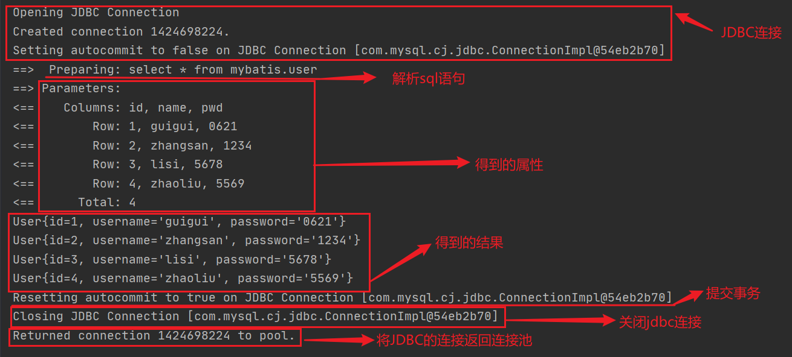

### 2、Log4j

什么是Log4j？

* Log4j是Apache的一个开源项目，通过使用Log4j，我们可以控制日志信息输送的目的地是控制台、文件、GUI组件
* 我们也可以控制每一条日志的输出格式
* 通过定义每一条日志信息的级别，我们能过够更加细致地控制日志的生成过程
* 通过一个配置文件来灵活地进行配置，而不需要修改应用的代码

1. 先导入log4j的包

   ```xml
   <!-- https://mvnrepository.com/artifact/log4j/log4j -->
   <dependency>
        <groupId>log4j</groupId>
        <artifactId>log4j</artifactId>
        <version>1.2.17</version>
   </dependency>
   ```

2. log4j.properties

   ```properties
   #将等级为DEBUG的日志信息输出到console和file两个目的地，console和file的定义在下面代码
   log4j.rootLogger=DEBUG,console,file
   
   #控制台输出的相关设置
   log4j.appender.console=org.apache.log4j.ConsoleAppender
   log4j.appender.console.Target = System.out
   log4j.appender.console.Threshold = DEBUG
   log4j.appender.console.layout = org.apache.log4j.PatternLayout
   log4j.appender.console.layout.ConversionPattern=[%c]-%m%n
   
   #文件输出的相关设置
   log4j.appender.file = org.apache.log4j.RollingFileAppender
   log4j.appender.file.File = ./log/guighost.log
   log4j.appender.file.MaxFileSize = 10mb
   log4j.appender.file.Threshold=DEBUG
   log4j.appender.file.layout = org.apache.log4j.PatternLayout
   log4j.appender.file.layout.ConversionPattern = [%p][%d{yy-MM-dd}][%c]%m%n
   
   #日志输出级别
   log4j.logger.org.mybatis = DEBUG
   log4j.logger.java.sql = DEBUG
   log4j.logger.java.sql.Statement = DEBUG
   log4j.logger.java.sql.ResultSet = DEBUG
   log4j.logger.java.sql.PreParedStatement = DEBUG
   ```

3. 配置log4j为日志的实现

   ```xml
   <settings>
        <setting name="logImpl" value="LOG4J"/>
   </settings>
   ```

4. log4j的使用！直接测试运行即可

   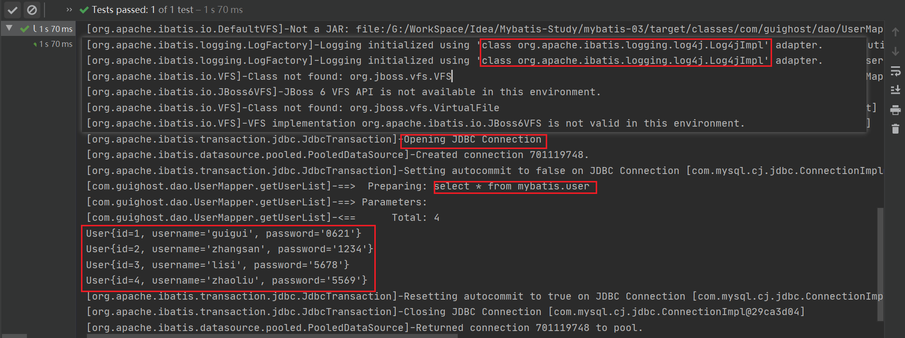


**简单使用**

1. 在要使用Log4j的类中导入包	import org.apache.log4j.Logger;

2. 日志对象，参数为当前类的class

   ```java
   static Logger logger = Logger.getLogger(UserDaoTest.class);
   ```

3. 日志级别

   ```java
   logger.info("info:我进入了Log4j");
   logger.debug("debug:我进入了Log4j");
   logger.error("error:我进入了Log4j");
   ```


# 七、分页

**为什么要分页？**

* 减少数据的处理量

### 1、**使用limit分页**

```sql
语法：
SELECT * FROM user LIMIT startIndex,pageSize;
SELECT * FROM user LIMIT 3;#[,0,n]
```

使用MyBatis实现分页，核心SQL

1. 接口

   ```java
   //分页
   List<User> getUserByLimit(Map<String,Integer> map);
   ```

2. Mapper.xml

   ```xml
   <!--分页-->
   <select id="getUserByLimit" parameterType="map" resultType="user">
        select id,name username,pwd password from user limit #{startIndex},#{pageSize}
   </select>
   ```

3. 测试

   ```java
   @Test
   public void getUserByLimit(){
        Map<String,Integer> map = new HashMap<String, Integer>();
        map.put("startIndex",1);
        map.put("pageSize",2);
        SqlSession sqlSession = MybatisUtils.getSqlSession();
        UserMapper userMapper = sqlSession.getMapper(UserMapper.class);
        List<User> userByLimit = userMapper.getUserByLimit(map);
        for (User user : userByLimit) {
             System.out.println(user);
        }
        sqlSession.close();
   }
   ```


### 2、RowBounds分页

不使用SQL实现分页

1. 接口

   ```java
   //RowBounds分页2
   List<User> getUserByRowBounds();
   ```

2. mapper.xml

   ```xml
   <select id="getUserByRowBounds" resultType="user">
        select id,name username,pwd password from user
   </select>
   ```

3. 测试

   ```java
   @Test
   public void getUserByRowBounds(){
        SqlSession sqlSession = MybatisUtils.getSqlSession();
   
        RowBounds rowBounds = new RowBounds(2, 2);
        List<User> userList = sqlSession.selectList("com.guighost.dao.UserMapper.getUserByRowBounds",null,rowBounds);
        for (User user : userList) {
             System.out.println(user);
        }
   
        sqlSession.close();
   }
   ```


### 3、分页插件

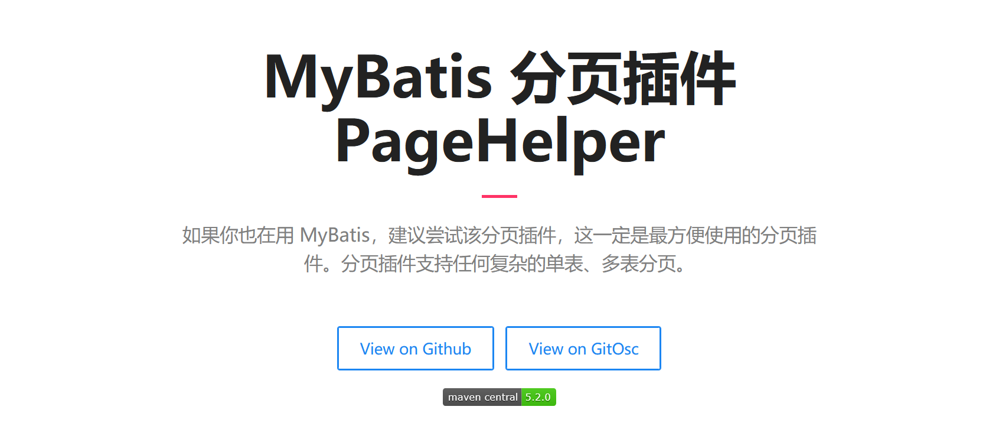

了解即可，以备不时之需

 

# 八、使用注解开发

### 1、面向接口编程

\-大家之前都学过面向对象编程，也学习过接口，但在真正的开发中，很多时候我们会选择面向接口编程

\-**根本原因：解耦，可扩展，提高复用，分层开发中，上层不用管具体的实现，大家都遵守共同的标准，使得开发变得容易，规范性更好**

\-在一个面向对象的系统中，系统的各种功能是由许许多多的不同对象协作完成的。在这种情况下，各个对象内部是如何实现自己的，对系统设计人员来讲就不那么重要了；

\-而各个对象之间的协作关系则成为系统设计的关键。小到不同类之间的通信，大到各模块之间的交互，在系统设计之初都是要着重考虑的，这也是系统设计的主要工作内容。面向接口编程就是指按照这种思想来编程。


**关于接口的理解**

\-接口从更深层的理解，应是定义（规范，约束）与实现（名实分离的原则）的分离。

\-接口的本身反映了系统设计人员对系统的抽象理解

\-接口应有两类：

​	\-第一类是对一个个体的抽象，它可对应为一个抽象体（abstract class）；

​	\-第二类是对一个个体某一方面的抽象，即形成一个抽象面（interface）；

\-一个体有可能有多个抽象面。抽象体与抽象面是有区别的。


**三个面向区别**

\-面向对象是指，我们考虑问题时，以对象为单位，考虑它的属性及方法

-面向过程是指，我们考虑问题时，以一个具体的流程（事物过程）为单位，考虑他的实现

-接口设计与非接口设计是针对复用技术而言的，与面向对象（过程）不是一个问题，更多的体现就是对系统整体的架构


### 2、使用注解开发

1. 注解在接口上实现

   ```java
   @Select("select id,name username,pwd password from user")
   List<User> getUsers();
   ```

2. 在mybatis核心配置文件中绑定接口（注册接口）

   ```xml
   <mappers>
        <mapper class="com.guighost.dao.UserMapper"/>
   </mappers>
   ```

3. 测试


本质：反射机制实现

底层：动态代理

​	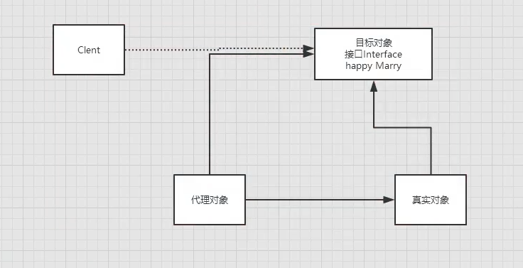


**MyBatis详细的执行流程！**

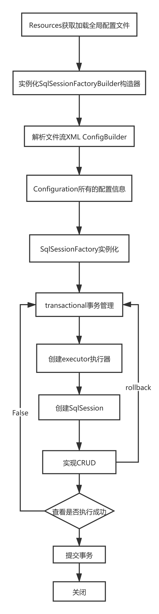


### 3、CRUD

我们可以在工具类创建的时候实现自动提交事务！

```java
public static SqlSession getSqlSession(){
     return sqlSessionFactory.openSession(true);//true参数设置自动提交事务
}
```

编写接口，增加注解

```java
/**
 * @InterfaceName UserDao
 * @Description TODO
 * @Author GuiGhost
 * @Date 2021/01/26 13:49
 * @Version 1.0
 **/
public interface UserMapper {

     @Select("select id,name username,pwd password from user")
     List<User> getUsers();

     //方法有多个参数时，每个参数前必须加上@Param("xxx")注解
     @Select("select id,name username,pwd password from user where id = #{id}")
     User getUserById(@Param("id") int id);

     //增加
     @Insert("insert into user(id,name,pwd) values(#{id},#{username},#{password})")
     int addUser(User user);

     //修改
     @Update("update user set name = #{username} where id = #{id}")
     int updateUser(User user);

     //删除
     @Delete("delete from user where id = #{id}")
     int deleteUser(@Param("id") int id);

}
```


测试

【注意：我们必须要将接口注册绑定到MyBatis的核心配置文件中!】

**关于@Param()注解**

* 基本数据类型的参数或者String类型，需要加上该注解
* 引用类型不需要加
* 如果只有一个基本类型，可以忽略，但建议加上
* 我们在SQL中引用的就是我们这里的@Param("id")中设定的属性名(id)！


**#{}和${}的区别**

* #{}可以有效的防止SQL的注入


# 九、Lombok

```java
Project Lombok is a java library that automatically plugs into your editor and build tools, spicing up your java.
Never write another getter or equals method again, with one annotation your class has a fully featured builder, Automate your logging variables, and much more. 
```

* java library
* plugs
* build tools
* with one annotation your class


使用步骤：

1. 在IDEA中安装Lombok插件！

   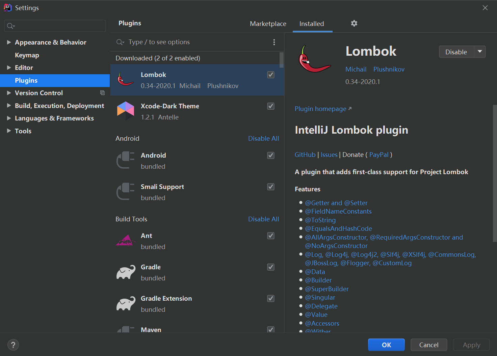

2. 在项目中导入Lombok的jar包

   ```xml
   <!-- https://mvnrepository.com/artifact/org.projectlombok/lombok -->
   <dependency>
        <groupId>org.projectlombok</groupId>
        <artifactId>lombok</artifactId>
        <version>1.18.12</version>
        <scope>provided</scope>
   </dependency>
   ```

3. 常见注解，这些注解直接加在实体类上即可

```java
@Getter and @Setter
@FieldNameConstants
@ToString
@EqualsAndHashCode
@AllArgsConstructor, @RequiredArgsConstructor and @NoArgsConstructor
@Log, @Log4j, @Log4j2, @Slf4j, @XSlf4j, @CommonsLog, @JBossLog, @Flogger, @CustomLog
@Data
@Builder
@SuperBuilder
@Singular
@Delegate
@Value
@Accessors
@Wither
@With
@SneakyThrows
@val
@var
```

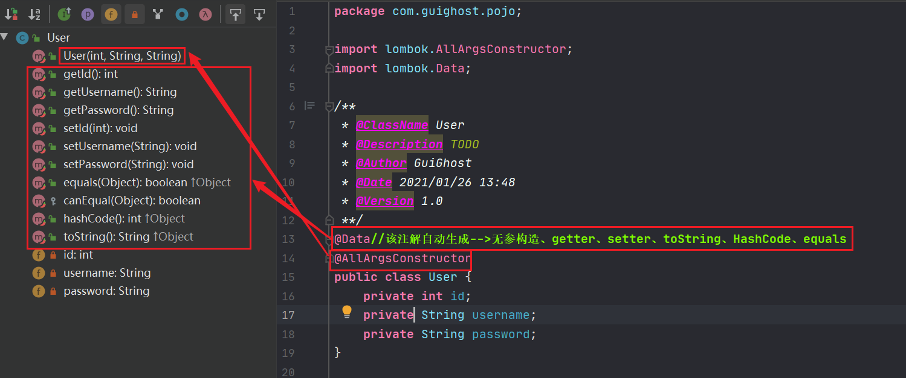

**说明**

```java
@Data：无参构造、getter、setter、toString、HashCode、equals
@AllArgsConstructor
@NoArgsConstructor
@EqualsAndHashCode
@ToString
@Getter
@Setter
```


# 十、多对一处理

多对一：

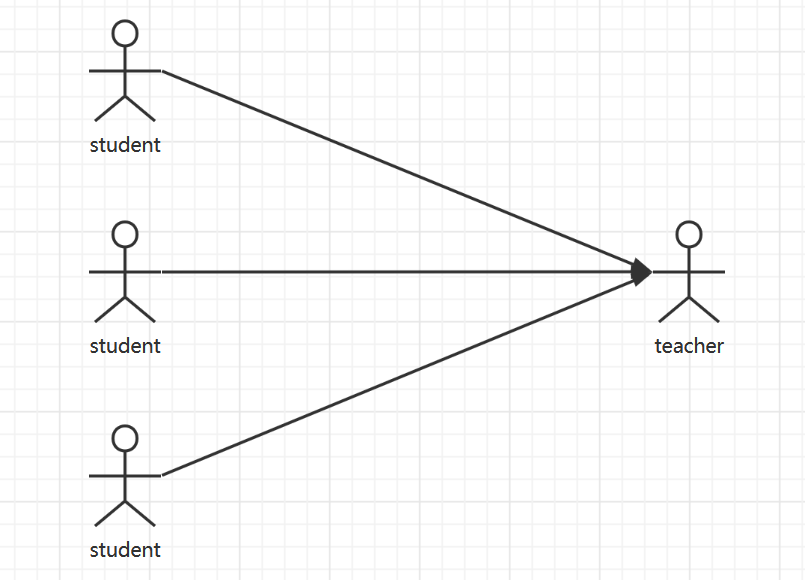

* 多个学生，对应一个老师
* 对于学生而言，关联：多个学生关联一个老师【多对一】 
* 对于老师而言，集合：一个老师有很多学生【一对多】

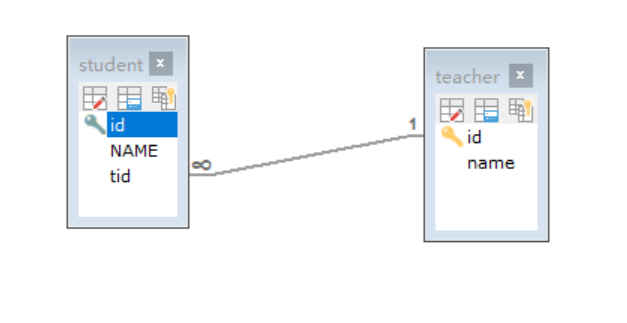

SQL：

```sql
CREATE TABLE teacher(
     id INT NOT NULL,
     name VARCHAR(30) DEFAULT NULL,
     PRIMARY KEY(id)
)ENGINE=INNODB DEFAULT CHARSET=utf8

INSERT INTO teacher(id,name) VALUES(1,'鬼老师');

CREATE TABLE student(
     id INT NOT NULL,
     NAME VARCHAR(30) DEFAULT NULL,
     tid INT DEFAULT NULL,
     PRIMARY KEY(id),
     KEY fktid(tid),
     CONSTRAINT fktid FOREIGN KEY(tid) REFERENCES teacher(id)
)ENGINE=INNODB DEFAULT CHARSET=utf8

INSERT INTO student(id,name,tid) VALUES(1,'张三',1),
(2,'李四',1),
(3,'王五',1),
(4,'赵六',1),
(5,'孙七',1);
```


### 测试环境搭建

1. 导入Lombok
2. 新建实体类Teacher、Student
3. 建立Mapper接口
4. 建立Mapper.xml文件
5. 在核心配置文件中绑定注册我们的Mapper接口或者文件【方式很多，随心选】
6. 测试查询是否能够成功


### 按照查询嵌套处理

```xml
<!--
     思路：
     1.查询所有的学生
     2.根据查询出来的学生的tid，查询对应的老师 ->子查询
     -->

     <select id="getStudent" resultMap="StudentTeacher">
     	select  * from student
     </select>
     
     <resultMap id="StudentTeacher" type="Student">
     	<result property="id" column="id"/>
     	<result property="name" column="name"/>
     	<!--复杂的属性，需要单独处理
     		对象：association
     		集合：collection
     	-->
     <association property="teacher" column="tid" javaType="Teacher" select="getTeacher"/>
     <!--
     association标签：表示为一个对象
     	属性：
     	property：Student实体类中的一个属性（teacher）
     	column：Student实体类对应数据库表中的一个字段（tid）
     	javaType：把该标签映射为Java中的一个对象，这里为Teacher对象
     	select：为该对象赋值，这里使用的是一条查询语句：
     		<select id="getTeacher" resultType="Teacher">
     			select * from teacher where id = #{id}
			</select>
     -->
     </resultMap>

     <select id="getTeacher" resultType="Teacher">
     	select * from teacher where id = #{id}
	</select>
```


### 按照结果嵌套处理

```xml
<!--按照结果嵌套处理-->
<select id="getStudent2" resultMap="StudentTeacher2">
     select s.id sid,s.name sname,t.name tname
     from student s,teacher t
     where s.tid = t.id
</select>
<resultMap id="StudentTeacher2" type="Student">
     <result property="id" column="sid"/>
     <result property="name" column="sname"/>
     <association property="teacher" javaType="Teacher">
          <result property="name" column="tname"/>
     </association>
</resultMap>
```


回顾MySQL多对一查询方式：

* 子查询
* 连表查询


# 十一、一对多

比如：一个老师拥有多个学生！

对于老师而言，便是一对多的关系！

### 环境搭建

**实体类**

```java
/**
 * @author GuiGhost
 * @date 2021/02/08
 * 说明：教师实体类
 */
@Data
public class Teacher {
     private int id;
     private String name;
     //一个老师拥有多个学生
     private List<Student> students;
}
```

```java
/**
* @author GuiGhost
* @date 2021/02/08
* 说明：学生实体类
*/
@Data
public class Student {
     private int id;
     private String name;
     private int teacher;
}
```


### 按结果嵌套处理

```xml
<select id="getTeacher" resultMap="TeacherStudent">
     select s.id sid,s.name sname,t.name tname,t.id tid
     from student s,teacher t
     where s.tid = t.id AND t.id = #{tid}
</select>

<resultMap id="TeacherStudent" type="Teacher">
     <result property="id" column="tid"/>
     <result property="name" column="tname"/>
     <!--复杂的属性，需要单独处理
       对象：association
       集合：collection
       javaType="" 指定属性的类型
       集合中的泛型信息，我们使用ofType获取
      -->
     <collection property="students" ofType="Student">
          <result property="id" column="sid"/>
          <result property="name" column="sname"/>
          <result property="tid" column="tid"/>
     </collection>
</resultMap>
```

### 按照查询嵌套处理

```xml
<select id="getTeacher2" resultMap="TeacherStudent2">
     select * from teacher where id = #{tid}
</select>
<resultMap id="TeacherStudent2" type="Teacher">
     <collection property="students" javaType="ArrayList" ofType="Student" select="getStudentByTid" column="id"/>
</resultMap>
<select id="getStudentByTid" resultType="Student">
     select * from student where tid = #{tid}
</select>
```


### 小结

1. 关联 - association	【多对一】
2. 集合 - collection       【一对多】
3. javaType  &  ofType
   1. javaType用来指定实体类中属性的类型
   2. ofType用来指定映射到LIst或者集合中的pojo类型，泛型中的约束类型


注意点：

* 保证SQL的可读性，尽量保证通俗易懂
* 注意一对多和多对一中属性名和字段的问题
* 如果问题不好排查，可以使用日志，建议Log4j


面试高频

* MySQL引擎
* InnoDB底层原理
* 索引
* 索引优化


# 十二、动态SQL**动态SQL是什么：动态SQL就是指根据不同的条件生成不同的SQL语句**== 
**动态SQL是什么：动态SQL就是指根据不同的条件生成不同的SQL语句** 

```xml
<!--动态SQL元素和JSTL或基于类似XML的文本处理器相似，借助功能强大的基于 OGNL 的表达式，MyBatis 3 替换了之前的大部分元素，大大精简了元素种类，现在要学习的元素种类比原来的一半还要少-->

if
choose (when, otherwise)
trim (where, set)
foreach

```

### 搭建环境

```sql
CREATE TABLE blog(
     id VARCHAR(40) NOT NULL COMMENT '博客id',
     title VARCHAR(100) NOT NULL COMMENT '博客标题',
     author VARCHAR(30) NOT NULL COMMENT '博客作者',
     create_time datetime NOT NULL COMMENT '创建时间',
     views int NOT NULL COMMENT '浏览量'
)ENGINE=INNODB DEFAULT CHARSET = utf8
```

创建一个基础工程

1. 导包

2. 编写配置文件

3. 编写实体类

   ```java
   /**
    * @author GuiGhost
    * @date 2021/02/12
    * 说明：博客实体类
    */
   @Data 
   @SuppressWarnings("all") //抑制所有警告
   public class Blog {
        private int id;
        private String title;
        private String author;
        private Date createTime;
        private int views;
   }
   ```

4. 编写实体类对应的Mapper接口和Mapper.xml文件

### IF

在原语句的基础上（不受if的影响，都会执行），加上一个if语句，如果条件成立，在原SQL语句上追加满足条件的语句

```xml
<select id="queryBlogIF" parameterType="map" resultType="blog">
     select * from blog where 1=1
     <if test="title != null">
          and title = #{title}
     </if>
     <if test="author != null">
          and author = #{author}
     </if>
</select>
```

### choose (when, otherwise)

类似于Java的switch语句，传入了 “title” 就按 “title” 查找，传入了 “author” 就按 “author” 查找的情形。若两者都没有传入，就执行otherwise标签中的语句

```xml
<select id="queryBlogChoose" parameterType="map" resultType="blog">
     select * from mybatis.blog
     <where>
          <choose>
               <when test="title != null">
                    title = #{title}
               </when>
               <when test="author != null">
                    and author = #{author}
               </when>
               <otherwise>
                    and views = #{views}
               </otherwise>
          </choose>
     </where>
</select>
```

### trim (where, set)

**where**：*where* 元素只会在子元素返回任何内容的情况下才插入 “WHERE” 子句。而且，若子句的开头为 “AND” 或 “OR”，*where* 元素也会将它们去除

```xml
select * from blog
<where>
     <if test="title != null">
          title = #{title}
     </if>
     <if test="author != null">
          and author = #{author}
     </if>
</where>
```

**set**：*set* 元素会动态地在行首插入 SET 关键字，并会删掉额外的逗号（这些逗号是在使用条件语句给列赋值时引入的）

```xml
<update id="updateBlog" parameterType="map">
     update mybatis.blog
     <set>
          <if test="title != null">
               title = #{title},
          </if>
          <if test="author != null">
               author = #{author}
          </if>
     </set>
     where id = #{id}
</update>
```

**trim**：

```xml
<trim prefix="" prefixOverrides="" suffix="" suffixOverrides="">

</trim>

```

所谓的动态SQL，本质还是SQL语句，只是我们可以在SQL层面，去执行一些逻辑代码，使SQL语句可以动态的调用


### Foreach

```sql
select * from user where 1=1 and 

<foreach item="id" index="index" collection="ids"
      open="(" separator="or" close=")">
        #{id}
  </foreach>

(id=1 or id=2 or id=3)
```

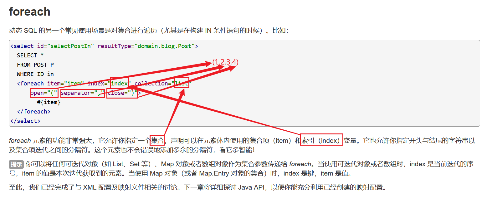

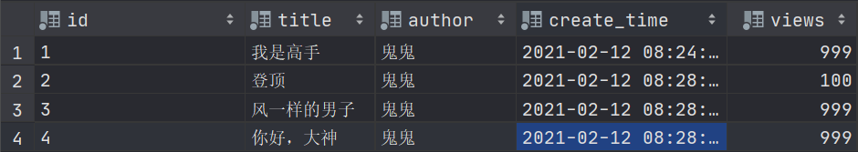

```xml
<select id="queryBlogByForeach" parameterType="map" resultType="blog">
     select * from mybatis.blog
     <where>
          <foreach collection="ids" item="id" open="and (" close=")" separator="or">
               id = #{id}
          </foreach>
     </where>
</select>
```


### SQL片段

有的时候，我们可能会将一些功能的部分抽取出来，方便复用！

1. 使用SQL标签抽取公共的部分

   ```xml
   <sql id="if-title-author">
        <if test="title != null">
             title = #{title}
        </if>
        <if test="author != null">
             and author = #{author}
        </if>
   </sql>
   ```

   

2. 在需要使用的地方使用include标签引用即可

   ```xml
   <select id="queryBlogIF" parameterType="map" resultType="blog">
        select * from blog
        <where>
             <include refid="if-title-author"></include>
        </where>
   </select>
   ```


注意事项：

* 最好基于单表老定义SQL片段！
* SQL片段内不要存在where标签

# 十三、缓存

### 1、简介

```
查询：连接数据库 ， 耗资源！
	一次查询的结果，暂时存储到一个可以直接调用的地方——>内存：缓存

我们再次查询相同数据的时候，直接走缓存，就不用走数据库了
```

1. 什么是缓存[cache]?
   - 存在内存中的临时数据
   - 将用户经常查询的数据放在缓存，用户查询数据就不用从磁盘上(关系型数据库数据文件)查询，从缓存中查询，从而提高查询效率，解决了高并发系统的性能问题。
2. 为什么使用缓存？
   - 减少和数据库的交互次数，减少系统开销，提高系统效率。
3. 什么样的数据能使用缓存？
   - 经常查询并且不经常改变的数据


### 2、MyBatis缓存

* MyBatis包含了一个非常强大的查询缓存特性，它可以非常方便地定制和配置缓存。缓存可以极大的提升查询效率。
* MyBatis系统中默认定义了两级缓存：**一级缓存**和**二级缓存**
  * 默认情况下，只有一级缓存开启。（SqlSession级别的缓存，也称为本地缓存）
  * 二级缓存需要手动开启和配置，他是基于namespace级别的缓存
  * 为了提高扩展性，MyBatis定义了缓存接口Cache。我们可以通过实现Cache接口来自定义二级缓存


### 3、一级缓存

* 一级缓存也叫本地缓存：
  * 与数据库同一次会话期间查询到的数据会放在本地缓存中。
  * 以后如果需要获取相同的数据，直接从缓存中拿，没必要再去查询数据库；


测试步骤：

1. 开启日志

   ```xml
   <settings>
        <setting name="logImpl" value="STDOUT_LOGGING"/><!--标准的日志工厂实现-->
   </settings>
   ```

2. 测试在一个SqlSession中查询两次相同记录

   ```java
   @Test
   public void test(){
        SqlSession sqlSession = MybatisUtils.getSqlSession();
        UserMapper mapper = sqlSession.getMapper(UserMapper.class);
        User user = mapper.queryUserById(1);
        System.out.println(user);
        System.out.println("===========================================");
        User user1 = mapper.queryUserById(1);
        System.out.println(user1);
        System.out.println(user==user1);
        sqlSession.close();
   }
   ```

3. 查看日志输出

   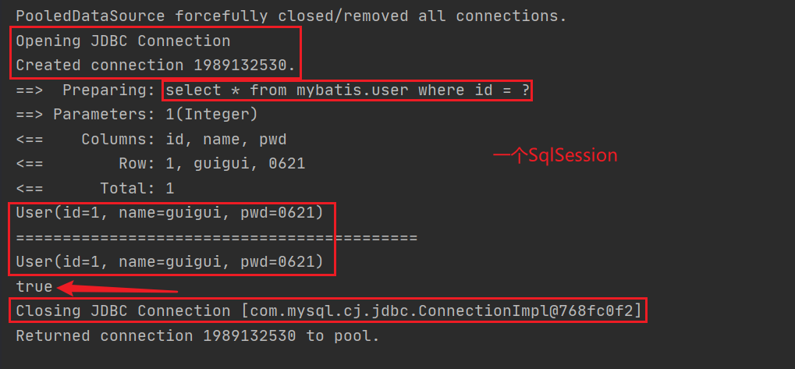

缓存失效情况：

1.  查询不同的东西

2. 增删改操作，可能会改变原来的数据，所以必定会刷新缓存

3. 查询不同的Mapper.xml

4. 手动请理缓存

   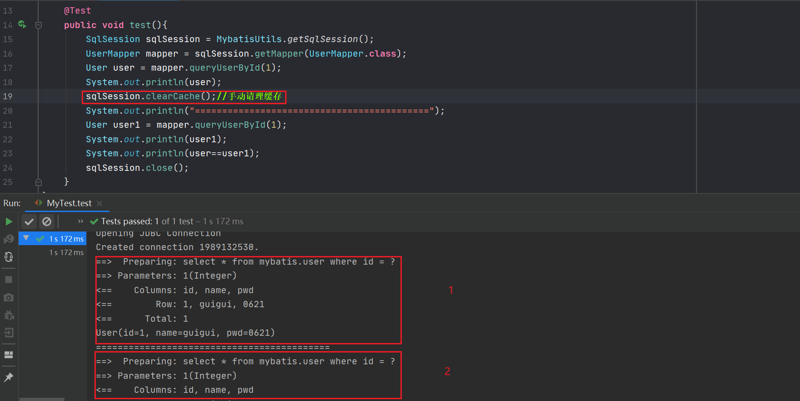


**小结：**

* 一级缓存默认是开启的，只在一次SqlSession中有效，也就是拿到连接一直到关闭连接这个区间段
* 一级缓存就是一个Map

### 4、二级缓存

* 二级缓存也叫全局缓存，一级缓存作用域太低，所以才有了二级缓存
* 基于namespace级别的缓存，一个名称空间，对应一个二级缓存；
* 工作机制：
  * 一个会话查询一条数据，这个数据就会被放在当前会话的一级缓存中；
  * 如果当前会话关闭了，这个会话对应的一级缓存就没有了，但是我们像要的是，会话关闭，一级缓存中的数据被保存到二级缓存中
  * 新的会话查询信息，就可以从二级缓存中获取内容
  * 不同的mapper查出的数据会放在自己对应的缓存（map）中


步骤

1. 开启全局缓存 

   ```xml
   <settings>
        <!--显示的开启全局缓存-->
        <setting name="cacheEnabled" value="true"/>
   </settings>
   ```

2. 在要使用二级缓存的Mappe.xml中开启

   ```xml
   <!--在当前Mapper.xml中使用二级缓存-->
   <cache/>
   ```

   也可以自定义参数

   ```xml
   <!--在当前Mapper.xml中使用二级缓存-->
   <cache
          eviction="FIFO"
          flushInterval="60000"
          size="512"
          readOnly="true"/>
   ```

   

   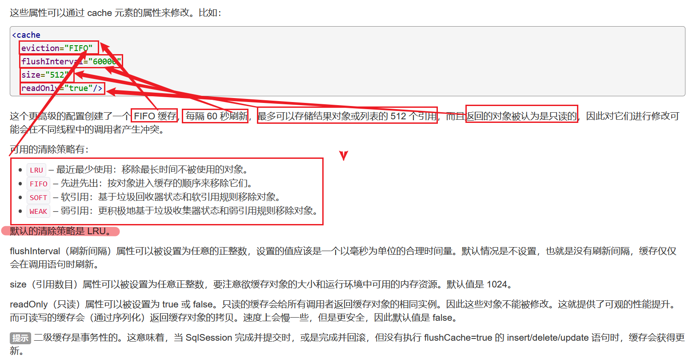

3. 测试 

   1. 问题：我们需要将实体类序列化(实现java.io包下的Serializable接口)！否则就会报错

      ```
      Caused by: java.io.NotSerializableException: com.guighost.pojo.User
      ```


**小结：**

* 只要开启了二级缓存，在同一个Mapper下就有效
* 所有的数据都会先放在一级缓存中
* 只有当会话提交，或者关闭的时候，才会将数据提交到二级缓存中


### 5、MyBatis缓存的原理

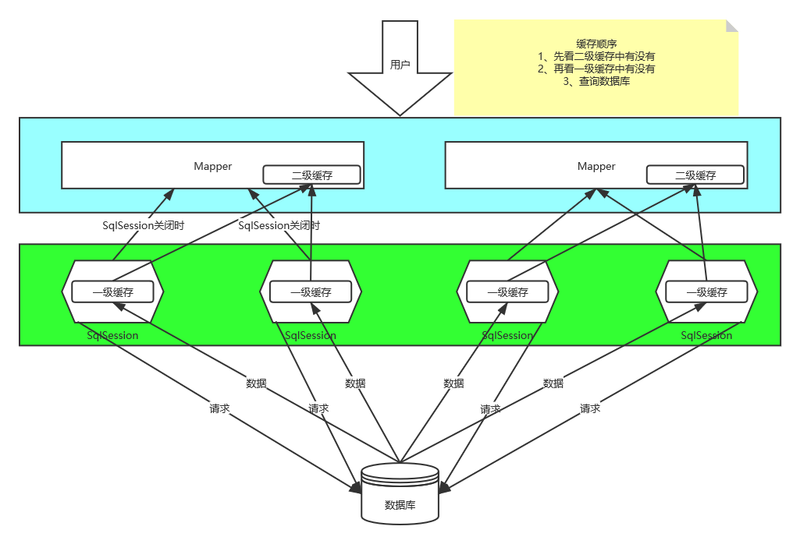


### 6、自定义缓存——ehcache

```xml
Ehcache是一种广泛使用的开源Java分布式缓存。主要面向通用缓存,Java EE和轻量级容器
```

要在程序中使用ehcache，先导包

```xml
<!-- https://mvnrepository.com/artifact/org.mybatis.caches/mybatis-ehcache -->
<dependency>
     <groupId>org.mybatis.caches</groupId>
     <artifactId>mybatis-ehcache</artifactId>
     <version>1.1.0</version>
</dependency>
```

在mapper.xml中指定使用我们的ehcache缓存实现！

```xml
<cache type="org.mybatis.caches.ehcache.EhcacheCache"/>
```

ehcache.xml

```xml

```


Redis数据库来做缓存